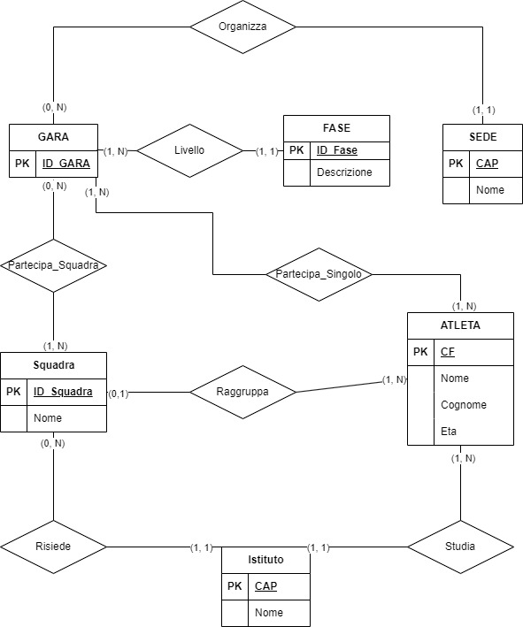

# Soluzione Seconda prova
## Oplimpiadi di informatca

Il nostro compito, in questa simulazione d'esame, è quello di organizzare e progettare un sistema informatico per la gestione delle prossime olimpiadi di informatica. Lo scopo era quello di ideare un database in grado du contere le informazioni relative:
- alle diverse fasi delle gare.
- alle gare e le loro sedi.
- ai singoli partecipanti che volendo si possono aggregare in squadre.

Abbiamo così creato un database sulla base di queste informazioni, raigionando anche su alcune ipotesi aggiuntive. 
Siamo partiti creando le prime identità più importatnti dello schema relazionale: la squadra, il singolo concorrente e le fasi delle gare.
Le prime due entità erano ovvimente legate tra loro, visto che, una squadra non è altro che un insieme di conconrrenti, inoltre entrambe hanno una relazione con la gara, che noi abbiamo trasposto come entità a parte. Abbiamo notato come l'entità gara è strettamente legata con una relazione all'entità fase e a quella della sede. Dopo aver impostato la nostra entità gara, abbiamo individuato due nuove relazoni tra i concorretni e con la squadra che prende il nome di "partecipa", aggiungendo come attributo alla relazione la posizione in classifica.
Infine abbiamo deciso che, per facilitare alcune query nella traccia, bisognava aggiungere l'entità dell'istituto, al quale  abbiamo collegato sia gli studenti che le squadre.

 