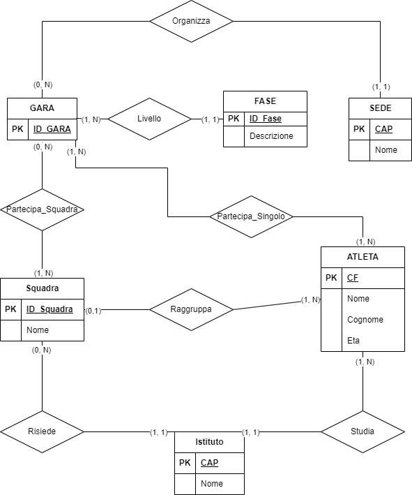

# Soluzione della prova

## Analisi della realtà di riferimento
//da inserire

## Schema concettuale della base di dati


## Schema logico della base di dati

- **Istituto**: Nome, *CAP_Istituto*(PK);
- **Sede**: Nome, *CAP_Sede*(PK);
- **Fase**: *ID_Fase*(PK), Descrizione;
- **Atleta**: Nome, Cognome, Eta, *CAP_Istituto*(FK), *CF*(PK), *ID_Squadra*(FK);
- **Squadra**: *ID_Squadra*(PK), Nome, *CAP_Istituto*(FK);
- **Gara**: *ID_Gara*(PK), *ID_Fase*(FK), *CAP_Sede*(FK);
- **Partecipa_squadra**: *ID_Squadra*(FK), *ID_Gara*(FK), Posizione;
- **Partecipa_singolo**: *ID_Atleta*(FK), *ID_Gara*(FK), Posizione;

## Definizione delle relazioni della base di dati in linguaggio SQL
```sql
create table istituto (
	nome varchar(20),
    cap_istituto varchar(20)  not null primary key
);

create table sede (
	nome varchar(20),
    cap_sede varchar(20)  not null primary key
);

create table fase (
	id_fase int not null primary key,
	descrizione varchar(20)
);

create table atleta (
	nome varchar(20),
    cognome varchar(20),
    eta varchar(20),
    cap_istituto varchar(20),
    cf varchar(20) not null primary key,
    id_squadra varchar(20),
    foreign key (id_squadra) references squadra (id_squadra),
    foreign key (cap_istituto) references istituto (cap_istituto)
);

create table squadra (
	id_squadra int primary key auto_increment,
	nome varchar(20),
	cap_istituto varchar(20),
    foreign key (cf_atleta) references atleta(cf),
    foreign key (cap_istituto) references istituto (cap_istituto)
);

create table gara (
	id_gara int auto_increment primary key,
    id_fase int,
    cap_sede varchar(30),
    foreign key(cap_sede) references sede (cap_sede),
    foreign key(id_fase) references fase (id_fase)
);

create table partecipa_squadra (
	id_squadra int,
	id_gara varchar(20),
	posizione int,
	foreign key(id_squadra) references squadra (id_squadra),
    foreign key(id_gara) references gara (id_gara)
);

create table partecipa_singolo (
	cf_atleta varchar(20),
    id_gara varchar(20),
	posizione int,
    foreign key(cf_atleta) references atleta (cf),
    foreign key(id_gara) references gara (id_gara)
);
```
## La seguenti interrogazioni espresse in linguaggio SQL
- stampare l’elenco degli atleti raggruppati per squadre per ogni singola fase:
```sql
SELECT
```
- dato il nome di un atleta stampare i risultati ottenuti nelle diverse gare alle quali ha partecipato:
```sql
SELECT
```
- stampare il calendario delle gare:
```sql
SELECT
```
- stampare una scheda informativa (cognome, nome, istituto scolastico di provenienza, nazionalità) del vincitore e della squadra vincitrice:
```sql
SELECT
```
- stampare la classifica per ciascuna gara (a parità di punteggio vengono privilegiati gli atleti più giovani):
```sql
SELECT
```
- aggiornare, per ciascuna fase (scolastica-regionale-nazionale-internazionale) gli eventuali punteggi record:
```sql
SELECT
```
- calcolare il punteggio medio ottenuto durante la prima selezione, per ciascun istituto scolastico:
```sql
SELECT
```
- stampare per ciascuna squadra il numero di “atleti” partecipanti e l’età media:
```sql
SELECT
```
## L’interfaccia utente che il candidato intende proporre per interagire con la base di dati e codificare in un linguaggio di programmazione a scelta un segmento significativo del progetto realizzato.
//da inserire

## Un sito Internet che presenti al pubblico le classifiche delle diverse gare.
//da inserire