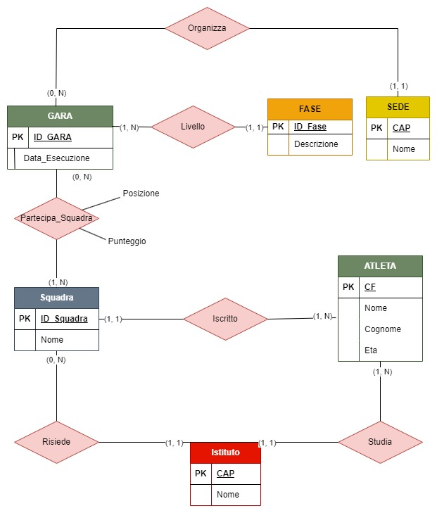
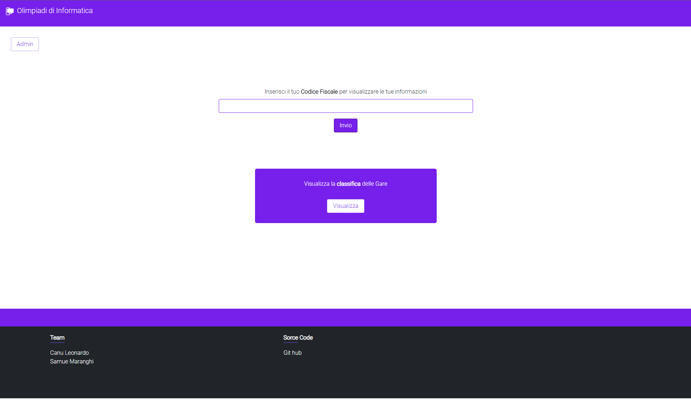

# Soluzione della prova

## Analisi della realtà di riferimento e soluzione ipotizzata

### Esposizione del problema
In questa prova ci è stato chiesto di ideare, progettare e realizzare un sistema di gestione degli "atleti" che hanno partecipato alle Olimpiadi di Informatica che si sono tenute nell'anno 2008.<br>
Il nostro compito è quello di creare un database e un sistema informativo in grado di memorizzare le informazioni degli alunni, che possono partecipare come squadra oppure come singolo, le informazioni riguardo alle gare e le rispettive sedi nelle quali si svolgeranno le prove.<br>
Le Olimpiadi in questione prevedono una suddivisione in fasi: una scolastica, tenuta nelle scuole, una fase regionale, una finale nazionale e una internazionale che eleggerà il vincitore assoluto.

### Architettura del sistema
Il portale sarà presente sul nostro server, all’interno della rete della nostra azienda, assieme al database, ma su due macchine differenti. Ovviamente verrà acquistato un dominio e verrà implementato sul nostro router perimetrale un servizio di PAT, così da permetterci di convogliare tutte le richieste sulla macchina che ospita il sito. Dato che comunque si tratta di un evento di portata internazionale, probabilmente non ci sarà un sistema informatico soltanto nel perimetro italiano, ma sarà ridondato in più zone, così da ridurre il carico per tutte le macchine. Ogni sistema avrà accesso agli stessi dati presenti sullo stesso database, tramite una **vpn side-to-side** che li farà accedere a tutte le informazioni proprio come se ogni sistema fosse tra i computer dell’azienda.<br>
Verrà anche implementato un firewall, che permetterà le connessioni in entrata soltanto sulle porte 443 e 80. <br>
Vista l'importanza dell'evento, implementeremo anche dei proxy così da garantire la sicurezza nella condivisione dei risultati delle classifiche effettuando dei controlli sulle connessioni.
Subito prima della rete contenente il nostro database verrà implementata anche una rete DMZ, così da garantire la massima sicurezza su tutti i dati.

### Il portale web
La nostra intenzione è quella di creare un **applicativo web** che permetterà agli atleti e squadre di visualizzare le informazioni relative alla  loro posizione in classifica, con una piccola sezione di accesso per un amministratore che permetterà l’inserimento di nuovi atleti, squadre e gare.<br>
L’ applicativo sarà implementato tramite linguaggio **php**, del quale utilizzeremo le funzioni relative alla libreria ‘*mysqli*’ per effettuare chiamate al database. <br>
Come ipotesi aggiuntiva abbiamo pensato alla possibilità di accedere al portale senza credenziali specifiche (con un bottone apposito), così facendo si potrà entrare nel portale come spettatore e potremo visualizzare l'andamento generale e la classifica.<br>
Il portale di accesso sarà un form che richiede il tuo codice fiscale, che ti permetterà di entrare in una pagina che visualizza la tua posizione, le tue vittorie, le sedi in cui hai vinto e in quali fasi, ricostruendo così il tuo “*percorso*”. <br>
Infine sarà presente un bottone di accesso per l’amministratore, che tramite una password, permetterà di accedere ad una pagina con la possibilità di aggiungere o rimuovere squadre, atleti e gare. Abbiamo deciso di gestire questo piccolo form di accesso tramite linguaggio javascript per poter eseguire il controllo della password senza inviare i dati e ricaricare la pagina, come farebbe il linguaggio php. Dato che questo metodo fornisce poca sicurezza, la nostra idea è quella di tradurre la password grazie alla funzione **hash** di javascript e di confrontarla con una stringa già tradotta presente nel codice.

### Back-end 
Nel lato back end attraverso **php** interrogheremo il nostro database grazie ai metodi della libreria php **MYSQLI** che permette di connetterci al database e inviare query e di gestirne i risultati con diversi metodi, come ```fetch_assoc()``` ( che ritorna le informazioni sotto forma di un array associativo) e ```fetch_num()``` (ritorna le informazioni sotto forma di un array numerativo).<br>
Il CF verrà perso in input nel form, così possiamo scoprire se stiamo prendendo le informazioni da un singolo atleta oppure da una squadra. Il database ci munirà delle informazioni per costruire la pagina, e grazie al codice **php** verrà personalizzata la pagina per gli atleti singoli o per le squadre. <br>

### Creazione del database
Abbiamo dedotto, dal testo, che per giungere alla soluzione del problema sono necessarie ben sei entità principali: Gara, Fase, Sede, Squadra, Atleta, Istituto.<br>
Dopo un'attenta analisi siamo giunti alla conclusione che l'entità intorno alla quale gira tutto il database è quella della **Gara** dove vi possono partecipare gli **Atleti**, raggruppati in **Squadre** oppure come singoli. Ogni gara è caratterizzata dalla **Sede** che la ospita e dal "livello" della prova, riassunto nella **Fase**.<br>
Leggendo attentamente tutta la traccia, abbiano notato come sia necessario l'**Istituto** di provenienza delle squadre e degli studenti. Molto probabilmente, nel sistema informatico vero e proprio, inseriremo come vincolo che gli atleti di una squadra siano iscritti tutti allo stesso istituto.<br>
Inoltre, per semplificare il sistema di classifiche abbiamo deciso che gli atleti singoli, comunque avranno una squadra tutta per sé, che condividerà il nome e l’istituto con l’atleta.

### Descrizione delle tabelle

- **Gara**: l'entità gara, di per sè, ha soltanto l'attributo identificativo e la data in cui si è svolta, ma grazie alle relazioni con la *Sede* e con la *Fase* acquisisce le loro chiavi esterne. Ovviamente la gara è caratterizzata proprio dal luogo dove si svolge e dalla fase.<br>
- **Sede**: l'entità sede è l'entità che rappresenta il luogo nel quale si svolgerà la singola *gara*. Questa Entità è stata citata specificatamente nel testo e la sua unica relazione è, appunto, con la *gara* stessa. Gli attributi che la caratterizzano sono il nome del luogo e il CAP, che grazie a tutte e cinque le cifre la identifica univocamente.<br>
- **Fase**: l'entità della fase è molto importante, permette di distinguere il livello delle varie gare, pertanto si lega soltanto ad essa tramite una relazione 1 a N. Oltre ad avere un identificativo artificiale (che sarà : *1* per le gare scolastica; *2* per quelle regionale; *3* per quelle nazionale; *4* per quelle internazionale) e dalla descrizione, che sarà semplicemente il grado della fase (es: nazionale).<br>
- **Atleta**: l'atleta o studente è l'entità che rappresenta i partecipanti alle nostre Olimpiadi. Oltre ad avere come attributo le classiche generalità (nome, cognome ed età) ha anche il Codice fiscale come chiave primaria e l'identificativo dell'istituto che lo ospita. Infine l'ultimo attributo è la squadra di appartenenza: un'atleta può scegliere se partecipare come singolo oppure in squadra. In caso un atleta fosse intenzionato a partecipare come singolo (per semplificazione del database e rendere il sito più veloce possibile), verrà creata appositamente una squadra con il singolo atleta. Infine, leggendo le richieste della traccia, abbiamo notato come sia necessario aggiungere la nazionalità dell’atleta. Nonostante l’inserimento di questo attributo vada contro le regole di normalizzazione, abbiamo deciso consapevolmente di inserirlo, per semplificare il database e alleggerire le query. <br>
- **Squadra**: la squadra è l'entità nella quale si raggruppano diversi atleti che vogliono partecipare alle Olimpiadi. La squadra dovrà scegliere un suo nome ma sarà comunque identificata da un ID, in oltre, dopo una più attenta analisi, abbiamo deciso di imporre come vincolo che tutta la squadra deve provenire dallo stesso istituto.<br>
- **Istituto**: L'istituto è un' entità che abbiamo deciso di inserire dopo esserci soffermati sulla normalizzazione delle nostre entità. Abbiamo notato, infatti, come essa sia presente nelle entità *Atleta* e *Squadra*, costringendoci a creare un'entità apposita, per evitare problemi di ridondanza e integrità. Così l'istituto è caratterizzato, come la sede, dal suo CAP. C'era la possibilità di riunire le entità Sede e Istituto, ma abbiamo deciso di inserire nel nostro sistema informativo la possibilità che una gara non si tenga all'interno di una scuola.<br>
- **Partecipa**: questa tabella viene creata dalla relazione N a N tra squadra e gara. Ha, come chiave, le chiavi delle entità che mette in relazione, con l'aggiunta della posizione in classifica e il suo punteggio.<br>  

  

## Schema concettuale della base di dati


## Schema logico della base di dati
- **Istituto**: Nome, *CAP_Istituto*(PK);
- **Sede**: Nome, *CAP_Sede*(PK);
- **Fase**: *ID_Fase*(PK), Descrizione;
- **Atleta**: Nome, Cognome, Eta, Nazionalità, *CAP_Istituto*(FK), *CF*(PK), *ID_Squadra*(FK);
- **Squadra**: *ID_Squadra*(PK), Nome, *CAP_Istituto*(FK);
- **Gara**: *ID_Gara*(PK), data_esecuzione, *ID_Fase*(FK), *CAP_Sede*(FK);
- **Partecipa**: *ID_Squadra*(FK), *ID_Gara*(FK), Posizione, Punteggio;

## Definizione delle relazioni della base di dati in linguaggio SQL
```sql
DROP DATABASE IF EXISTS Olimpiadi_di_Informatica;
CREATE DATABASE Olimpiadi_di_Informatica;
USE Olimpiadi_di_Informatica;

CREATE TABLE istituto (
    nome varchar(20),
    cap_istituto varchar(20)  not null primary key
);

CREATE TABLE sede (
    nome varchar(20),
    cap_sede varchar(20) not null primary key
);

CREATE TABLE fase (
    id_fase int not null primary key,
    descrizione varchar(20),
    record int
);

CREATE TABLE squadra (
    id_squadra int primary key auto_increment,
    nome varchar(20),
    cap_istituto varchar(20),
    foreign key (cap_istituto) references istituto (cap_istituto)
);

CREATE TABLE atleta (
    nome varchar(20),
    cognome varchar(20),
    eta int,
    cap_istituto varchar(20),
    cf varchar(20) not null primary key,
    id_squadra int,
    nazioalità varchar(30),
    foreign key (id_squadra) references squadra (id_squadra),
    foreign key (cap_istituto) references istituto (cap_istituto)
);

CREATE TABLE gara (
    id_gara int auto_increment primary key,
    id_fase int,
    cap_sede varchar(30),
    data_esecuzione Date,
    foreign key(cap_sede) references sede (cap_sede),
    foreign key(id_fase) references fase (id_fase)
);

CREATE TABLE partecipa(
    id_squadra int not null,
    id_gara int not null,
    posizione int,
    punteggio int,
    foreign key(id_squadra) references squadra (id_squadra),
    foreign key(id_gara) references gara (id_gara)
)
```
## Riempimento database consigliato per i test 
```sql
use Olimpiadi_di_Informatica;

insert into istituto
	values ("Istituto1", "10010"),
  ("Istituto2", "10020"),
  ("Istituto3", "10030"),
  ("Istituto4", "10040"),
  ("Istituto5", "10050"),
  ("Istituto6", "10060"),
  ("Istituto7", "10070");
 
insert into sede 
	values ("Sede1", "80010"),
  ("Sede2", "80020"),
  ("Sede3", "80030"),
  ("Sede4", "80040"),
  ("Sede5", "80050"),
  ("Sede6", "80060"),
  ("Sede7", "80070");
  
insert into fase 
 	values ( 1, "Scolastica", 9000),
  ( 2, "Regionale", 8000),
  ( 3, "Nazionale", 1000),
  ( 4, "Internazionale", 800);
 
 insert into squadra (nome, cap_istituto)
 	values ("Squadra1", "10010"),# id 1
  ("Squadra2", "10020"),# id 2
  ("Squadra3", "10030"),# id 3
  ("Squadra4", "10050"),# id 4
  ("Squadra5", "10060"),# id 5
  ("Squadra6", "10070");# id 6
  
insert into atleta 
	values ("Atleta1", "Atleta11", 17, "10010", "ABC123", 1, "Italia"),
  ("Atleta2", "Atleta12" , 16, "10010", "ABC1234", 2, "Italia"),
  ("Atleta3", "Atleta13" , 18, "10030", "ABC1235", 4, "Francia"),
  ("Atleta4", "Atleta14" , 19, "10010", "ABC1236", 5, "Italia"),
  ("Atleta5", "Atleta15" , 22, "10060", "ABC1237", 6, "Inghilterra"),
  ("Atleta6", "Atleta16" , 77, "10060", "ABC1238", 5, "Italia"),
  ("Atleta7", "Atleta17" , 17, "10060", "ABC1239", 5, "Svizzera"),
  ("Atleta1", "Atleta18" , 16, "10010", "ABCD123", 6, "Italia"),
  ("Atleta8", "Atleta19" , 20, "10070", "ABCE123", 3, "Germania"),
  ("Atleta9", "Atleta110", 10, "10070", "ABCF123", 1, "Italia");

  
insert into gara (id_fase, cap_sede, data_esecuzione)
	values (1, "80070", "2023-10-12"), # id 1
  (2, "80010", "2023-10-13"), # id 2
  (3, "80020", "2023-10-01"), # id 3
  (1, "80030", "2023-10-20"), # id 4
  (4, "80040", "2023-10-30"), # id 5
  (3, "80050", "2023-11-01"), # id 6
  (2, "80020", "2023-10-02"); # id 7
  
insert into partecipa
	values ( 2, 3, 3, 300),
  ( 3, 3, 3, 301),
  ( 4, 1, 3, 302),
  ( 6, 4, 1, 303),
  ( 1, 5, 3, 304),
  ( 5, 1, 3, 305),
  ( 6, 3, 3, 306),
  ( 3, 4, 2, 307);   
```

## La seguenti interrogazioni espresse in linguaggio SQL
- stampare l’elenco degli atleti raggruppati per squadre per ogni singola fase:
```sql
SELECT fase.descrizione, atleta.nome, squadra.nome FROM atleta
  INNER JOIN squadra ON squadra.id_squadra = atleta.id_squadra
  INNER JOIN partecipa ON partecipa.id_squadra = squadra.id_squadra
  INNER JOIN gara ON gara.id_gara = partecipa.id_gara
  INNER JOIN fase ON fase.id_fase = gara.id_gara  
  ORDER BY  fase.id_fase, squadra.id_squadra;
```
- dato il nome di un atleta stampare i risultati ottenuti nelle diverse gare alle quali ha partecipato:
```sql
SELECT fase.id_fase, partecipa.punteggio, partecipa.posizione FROM partecipa
  INNER JOIN squadra ON squadra.id_squadra = partecipa.id_squadra
  INNER JOIN atleta ON atleta.id_squadra = squadra.id_squadra
  INNER JOIN gara ON gara.id_gara = partecipa.id_gara
  INNER JOIN fase ON fase.id_fase = gara.id_fase
  WHERE atleta.nome = "NomeDato" # da cambiare, per esempio con ' Atleta1 '
  ORDER BY fase.id_fase;
```
- stampare il calendario delle gare:
```sql
SELECT gara.* FROM gara
  ORDER BY gara.data_esecuzione;
```
- stampare una scheda informativa (cognome, nome, istituto scolastico di provenienza, nazionalità) del vincitore e della squadra vincitrice:
```sql
SELECT squadra.nome, istituto.nome FROM squadra
  INNER JOIN istituto ON istituto.cap_istituto
  INNER JOIN partecipa ON partecipa.id_squadra = squadra.id_squadra
  INNER JOIN gara ON partecipa.id_gara = gara.id_gara
  INNER JOIN fase ON fase.id_fase = gara.id_gara
  WHERE fase.id_fase = 4
    AND partecipa.posizione = 1;
	#in questa query, a causa del fatto che la tabella 'partecipa' racchiude sia i singoli che le squadre, non è possibile distinguere l'atleta singolo vincitore 
```
- stampare la classifica per ciascuna gara (a parità di punteggio vengono privilegiati gli atleti più giovani):
```sql
SELECT gara.id_gara, partecipa.posizione, atleta.nome, atleta.cognome, atleta.eta, partecipa.punteggio FROM atleta
  INNER JOIN squadra ON squadra.id_squadra = atleta.id_squadra
  INNER JOIN partecipa ON  partecipa.id_squadra = squadra.id_squadra
  INNER JOIN gara ON gara.id_gara = partecipa.id_gara
  ORDER BY gara.id_gara, partecipa.punteggio, atleta.eta;
```
- aggiornare, per ciascuna fase (scolastica-regionale-nazionale-internazionale) gli eventuali punteggi record:
```sql
UPDATE fase
	SET fase.record = valore # valore inviato dal back-end
	WHERE fase.id_fase = 1;	# fase scolastica
UPDATE fase
	SET fase.record = valore # valore inviato dal back-end
	WHERE fase.id_fase = 2;	# fase regionale
UPDATE fase
	SET fase.record = valore # valore inviato dal back-end
  WHERE fase.id_fase = 3;	# fase nazionale
UPDATE fase
	SET fase.record = valore # valore inviato dal back-end
	WHERE fase.id_fase = 4;	# fase internazionale
## il controllo sul fatto che il punteggio sia effetivamente un record abbiamo deciso che verrebbe inserito nel Back-End 
```
- calcolare il punteggio medio ottenuto durante la prima selezione, per ciascun istituto scolastico:
```sql
SELECT istituto.nome, AVG(partecipa.punteggio) FROM partecipa
  INNER JOIN gara ON gara.id_gara = partecipa.id_gara
  INNER JOIN fase ON fase.id_fase = gara.id_gara
  INNER JOIN squadra ON squadra.id_squadra = partecipa.id_squadra
  INNER JOIN istituto ON istituto.cap_istituto = squadra.cap_istituto
  WHERE fase.id_fase = 1
  GROUP BY squadra.cap_istituto;
```
- stampare per ciascuna squadra il numero di “atleti” partecipanti e l’età media:
```sql
SELECT squadra.id_squadra, count(atleta.cf), AVG(atleta.eta) FROM atleta
  INNER JOIN squadra ON squadra.id_squadra = atleta.id_squadra
  GROUP BY squadra.id_squadra ;
```
## L’interfaccia utente che il candidato intende proporre per interagire con la base di dati e codificare in un linguaggio di programmazione a scelta un segmento significativo del progetto realizzato.
L'interfaccia utente che abbiamo pensato è composta da una home page, con alcuni bottoni che permettono  di visualizzare le informazioni relative alla  loro posizione in classifica di un atleta e della sua squadra, con una piccola sezione di accesso per un amministratore che permetterà l’inserimento di nuovi atleti, squadre e gare.
La home page avrà questo aspetto:

<br>
Abbiamo deciso di inserire il codice della pagina di visualizazione delle informazioni dell'atleta, alla quale si sccede inserendo il proprio codice fiscale.


## Un sito Internet che presenti al pubblico le classifiche delle diverse gare.
```php
<!DOCTYPE html>
<html>
<head></head>
<body>
    <h2>Scegli una fase</h2>
    <form method="get">
        <select name="Fase" onChange="this.form.submit()">
            <option value="" selected> <b>Scegli una fase</b>  </option>
            <?php
                session_start();
                if (isset($_GET['Fase'])){
                    $_SESSION['Fase'] = $_GET['Fase'];
                }else{
                    $_SESSION['Fase'] = 1;
                }
                $connection = new mysqli("localhost","root","", "Olimpiadi_di_Informatica");
                $richiesta = "select * from fase";
                $result = $connection -> query($richiesta);
                while($row = $result->fetch_assoc()){
                    echo "<option value='" . $row['id_fase'] . "'>" . $row['descrizione'] . "</option>";
                }
            ?>
        </select>
    </form>
    <table>
        <?php
            if (isset($_SESSION['Fase'])){
                $richiesta = "SELECT partecipa.posizione, squadra.nome FROM squadra
                            INNER JOIN partecipa ON  partecipa.id_squadra = squadra.id_squadra
                            INNER JOIN gara ON gara.id_gara = partecipa.id_gara
                            INNER JOIN fase ON fase.id_fase = gara.id_fase
                            WHERE fase.id_fase = " . $_SESSION['Fase'] . "
                            ORDER BY partecipa.posizione;";
                $result = $connection -> query($richiesta);
                while($row = $result->fetch_assoc()){
                echo "  <tr>
                            <td>" . $row['posizione'] . " </td>
                            <td>" . $row['nome'] . "</td>
                        </tr>";
                }
            }
        ?>
        
    </table>
</body>
</html>
```